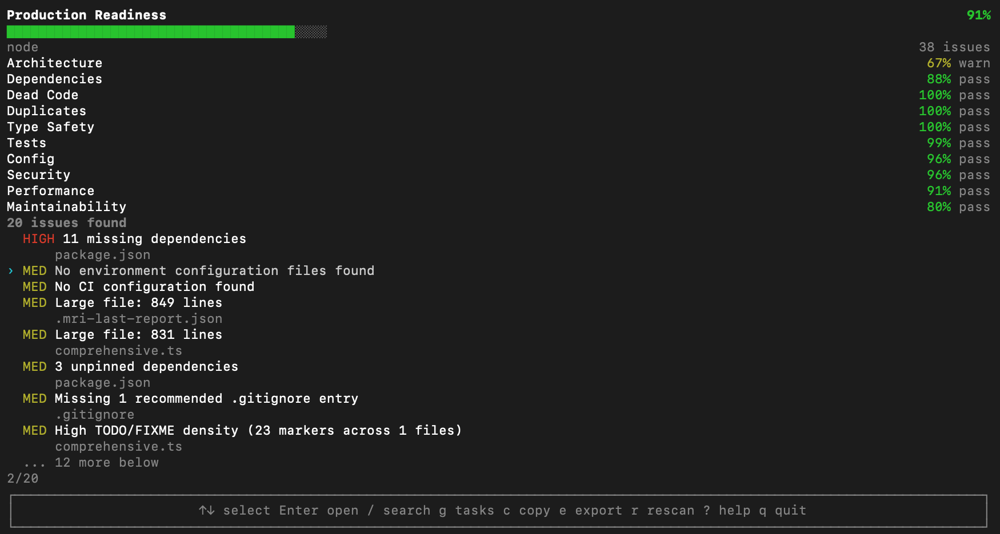
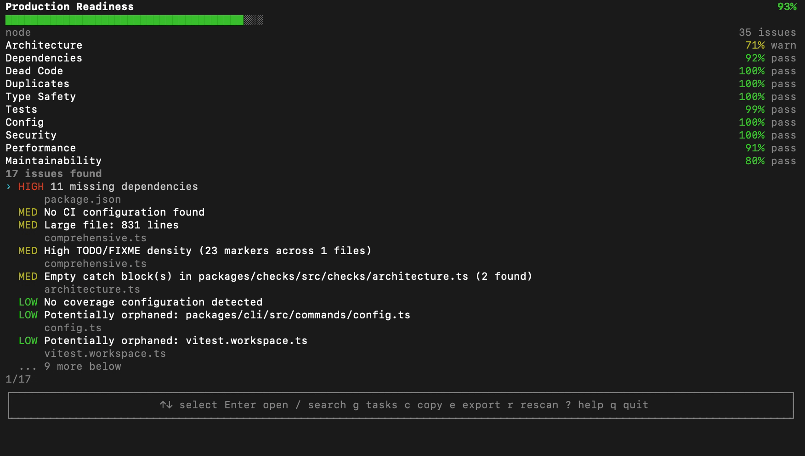
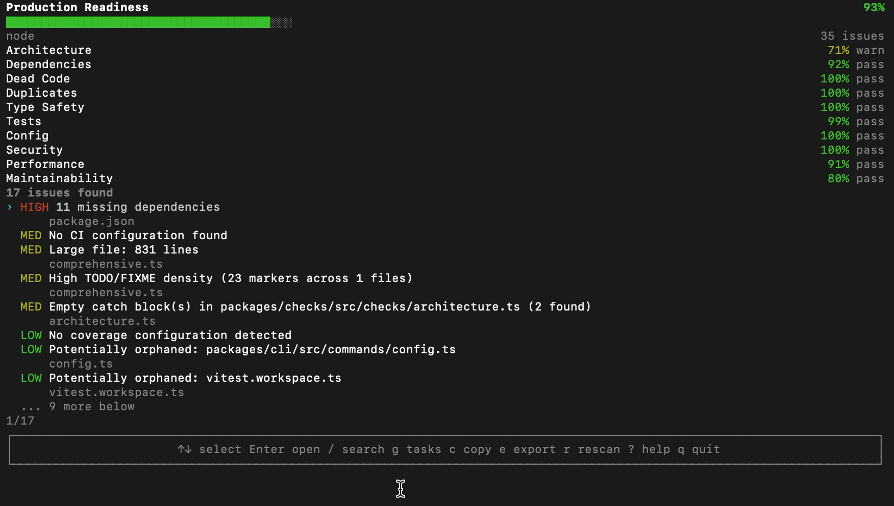

# MRI — Production Readiness Scanner

[](https://github.com/jacobpowaza/software-mri/actions/workflows/ci.yml)
[](https://www.npmjs.com/package/software-mri)
[](https://www.npmjs.com/package/software-mri)
[](https://nodejs.org)


**MRI scans your codebase and gives you a practical "production readiness" diagnosis** — no AI, no internet, just hard analysis of 50+ metrics across 10 categories.

```bash
npx software-mri scan
```



---

## Why MRI?

Most code quality tools either:
- **Nag you with trivial style issues** (ESLint, Prettier)
- **Require cloud infra** (SonarQube, CodeClimate)
- **Are framework-specific** (Next.js Analytics, Webpack Bundle Analyzer)
- **Cost money** (Snyk, Sentry)

MRI is none of those. It's a single `mri scan` command that runs locally, reads nothing but your filesystem, and produces a single number: **how ready is this codebase for production?**

## Quick Start

```bash
# Run a scan (from your project root)
npx software-mri scan

# Export a report
npx software-mri scan --format markdown --output report.md

# CI mode (exits with non-zero if score below threshold)
npx software-mri scan --ci

# See all options
npx software-mri --help
```



## Interactive TUI

Press `g` from any screen to open the task system. Create tasks with deadlines, track completion, and see a week-over-week progress graph.

| Key | Action |
|-----|--------|
| `↑/↓` | Navigate issues |
| `Enter` | Open issue detail |
| `g` | Open task system |
| `c` | Copy all issues to clipboard (as markdown) |
| `e` | Export report (JSON/MD/HTML) |
| `r` | Rescan |
| `f` | Dismiss/flag issue as false positive |
| `?` | Help |
| `q` | Quit |

### Task System

MRI includes a built-in task tracker so you can track the work items you uncover:

- **Create tasks** with preset titles or custom ones
- **Set deadlines** (today, tomorrow, this week, next week, this month)
- **Toggle completion** with Enter
- **Auto-grouped** into Overdue → Today → Active → Completed sections
- **7-day completion graph** shows your productivity trend



### Copy All Issues

Press `c` on the dashboard to copy every issue, its details, and recommendations to your clipboard as formatted markdown — perfect for pasting into a GitHub issue, sharing with your team, or feeding back into an LLM.

## How Scoring Works

MRI scores 10 categories on 0–100%, then weights them into a total score.

| Category | Weight | What It Checks |
|-----------|--------|----------------|
| Architecture | 12% | File sizes, folder depth, orphaned files, circular deps, direct DOM manipulation |
| Dependencies | 12% | Unused deps, missing deps, bloat (>100), unpinned versions |
| Dead Code | 10% | *(placeholder — checks import references)* |
| Duplicates | 8% | Duplicate functions, CSS class conflicts |
| Type Safety | 12% | strict mode, skipLibCheck, noImplicitAny, missing @types, export hygiene |
| Test Coverage | 12% | Missing framework, no test script, untested files, coverage config |
| Config Health | 8% | .env hygiene, engine requirements, env guards |
| Security | 10% | eval(), console.log, hardcoded URLs, .gitignore, insecure random, secrets detection, hardcoded credentials |
| Performance | 8% | Large deps, barrel files, heavy client imports, repeated imports, oversized files, large CSS, JSON in loops |
| Maintainability | 8% | README, license, CI, scripts, naming, TODO density, empty catches, unused async, deprecated APIs, JSDoc, mixed imports |

Each issue deducts from the base 100%. The deduction depends on:
- **Severity**: critical (-15), high (-8), medium (-4), low (-2), info (0)
- **Confidence**: high (1.0x), medium (0.7x), low (0.4x)
- **File count**: more files = higher multiplier (capped at 2.0x)

## All 50+ Checks

### Architecture
| Check | What It Finds |
|-------|---------------|
| `architecture-large-files` | Files exceeding line-count threshold |
| `architecture-deep-nesting` | Directories more than 6 levels deep |
| `architecture-orphan-files` | TS/JS files not imported by anything |
| `circular-deps` | Potential circular dependencies between directories |
| `direct-dom-mutation` | `document.getElementById`, `.innerHTML`, etc. in React components |

### Dependencies
| Check | What It Finds |
|-------|---------------|
| `deps-unused` | Packages in package.json never imported |
| `deps-missing` | Imports not declared in package.json |
| `deps-bloat` | More than 100 total dependencies |
| `deps-unpinned` | Version ranges (`^`, `~`) instead of exact versions |

### Type Safety
| Check | What It Finds |
|-------|---------------|
| `ts-strict-mode` | strict, noUncheckedIndexedAccess, noUnusedLocals, noUnusedParameters |
| `ts-skipLibCheck` | skipLibCheck enabled (hides real type errors) |
| `ts-noImplicitAny` | Missing noImplicitAny when strict is off |
| `ts-no-exports` | Files that import but export nothing |
| `ts-missing-types` | Dependencies without @types/ counterparts |

### Test Coverage
| Check | What It Finds |
|-------|---------------|
| `test-missing-framework` | No test framework in devDependencies |
| `test-missing-script` | No `test` script in package.json |
| `test-untested-files` | Source files without corresponding test files |
| `test-coverage-config` | No coverage configuration despite tests existing |

### Security
| Check | What It Finds |
|-------|---------------|
| `sec-eval` | eval() or Function() constructor |
| `sec-console-log` | console.log in production source files |
| `sec-hardcoded-urls` | Hardcoded http://localhost URLs |
| `sec-missing-gitignore` | Missing .gitignore or recommended entries |
| `sec-insecure-random` | Math.random() near security-sensitive code |
| `sec-env-secrets` | Potential secrets in .env files |
| `sec-hardcoded-credentials` | API keys, passwords, tokens, PEM keys in source |

### Performance
| Check | What It Finds |
|-------|---------------|
| `perf-large-dependencies` | Known heavy packages (moment, lodash, etc.) |
| `perf-barrel-files` | index.ts files with 10+ re-exports |
| `perf-client-imports` | Node.js modules in Next.js client components |
| `perf-repeated-imports` | Packages imported by 50%+ of files |
| `perf-oversized-files` | Files > 500 KB |
| `large-css-bundle` | CSS files > 50 KB |
| `json-serialization-hotpath` | JSON.parse/stringify inside loops |

### Maintainability
| Check | What It Finds |
|-------|---------------|
| `maintain-readme` | Missing README |
| `maintain-license` | Missing license |
| `maintain-contributing` | Missing CONTRIBUTING.md |
| `maintain-ci` | Missing CI configuration |
| `maintain-scripts` | Missing recommended package.json scripts |
| `maintain-inconsistent-naming` | Mixed PascalCase, camelCase, kebab-case |
| `todo-density` | 5+ TODO/FIXME/HACK markers per file |
| `empty-catch` | Empty catch blocks that swallow errors |
| `async-no-await` | Async functions with no await |
| `mixed-import-styles` | ESM + CommonJS in same file |
| `deprecated-apis` | .substr(), url.parse(), fs.exists(), request |
| `missing-documentation` | Exported functions without JSDoc |

### Config Health
| Check | What It Finds |
|-------|---------------|
| `env-comparison` | Missing env vars between .env files |
| `env-no-env-file` | No .env when .env.example exists |
| `engine-check` | Missing engines in package.json |
| `env-specific-guards` | process.env without fallback |

### Duplicates
| Check | What It Finds |
|-------|---------------|
| `dup-functions` | Same function name in 4+ files |
| `css-duplicate` | Same CSS class defined in multiple files |

### Dead Code
*(reserved for future checks)*

## Commands

| Command | Description |
|---------|-------------|
| `npx software-mri scan` | Run a scan and open the interactive TUI |
| `npx software-mri scan --ci` | CI mode — JSON output, exits non-zero below threshold |
| `npx software-mri scan --format markdown` | Export report as markdown (use --output) |
| `npx software-mri scan --format html` | Export report as HTML |
| `npx software-mri report` | Show last scan result |
| `npx software-mri doctor` | Dependency health check |
| `npx software-mri explain <issue-id>` | Detailed explanation of a specific issue |
| `npx software-mri export <format>` | Export the last scan |
| `npx software-mri init` | Create .mri/config.json |
| `npx software-mri config` | Open config in editor |
| `npx software-mri tasks list` | List tasks |
| `npx software-mri tasks add <title>` | Create a task |
| `npx software-mri tasks done <id>` | Mark task complete |

Alternatively, with a global install (`npm install -g software-mri`), replace `npx software-mri` with `mri`.

## Configuration

Create `.mri/config.json` to customize scoring:

```json
{
  "ignoredFolders": ["node_modules", "dist", "build"],
  "scoreWeights": {
    "security": 0.15,
    "typeSafety": 0.15
  },
  "strictness": "medium",
  "scoreThreshold": 70,
  "fileSizeThreshold": 500
}
```

| Option | Default | Description |
|--------|---------|-------------|
| `ignoredFolders` | node_modules, .next, dist, etc. | Folders to skip during scanning |
| `scoreWeights` | {} | Override category weights |
| `fileSizeThreshold` | 500 | Line count threshold for large file warnings |
| `strictness` | "medium" | Adjusts severity of checks |
| `scoreThreshold` | 70 | Minimum acceptable score (for CI mode) |

## Installation

```bash
npm install software-mri
```

Or globally for `mri` command anywhere:

```bash
npm install -g software-mri
mri scan
```

Or run without installing:

```bash
npx software-mri scan
```

## Architecture

MRI is organized as a pnpm monorepo with 8 packages:

```
packages/
  core/        - Types, config, goals/tasks store
  scanner/     - File system scanner
  checks/      - 50+ check implementations (monorepo)
  scoring/     - Scoring engine and category calculations
  reporter/    - JSON/Markdown/HTML report generators
  ui/          - Ink-based interactive TUI components
  cli/         - CLI entry point (yargs) — main npm package
  config/      - Config file loading/validation
```

## License

MIT — freely use, modify, and distribute.

## Contributing

PRs welcome! See [CONTRIBUTING.md](CONTRIBUTING.md) for guidelines.